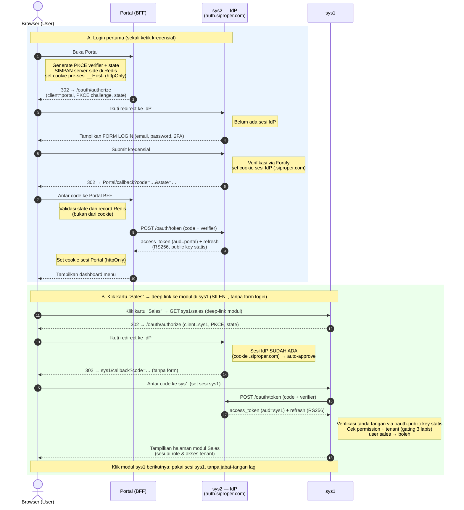
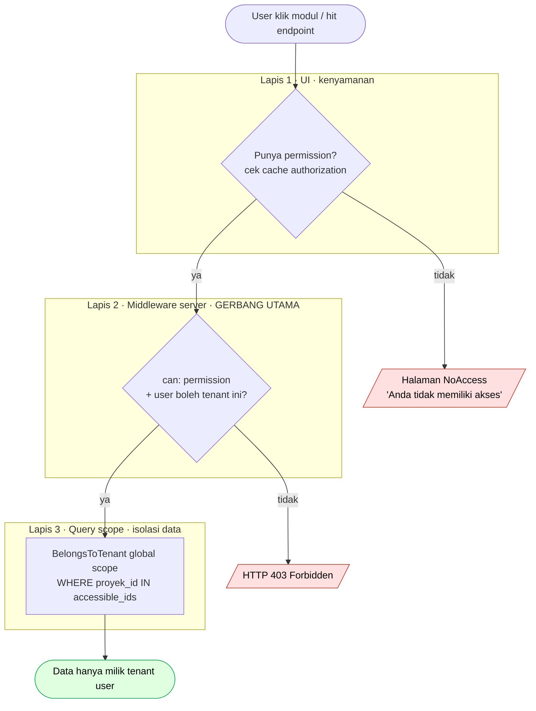
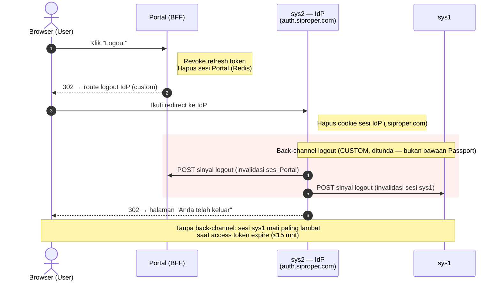
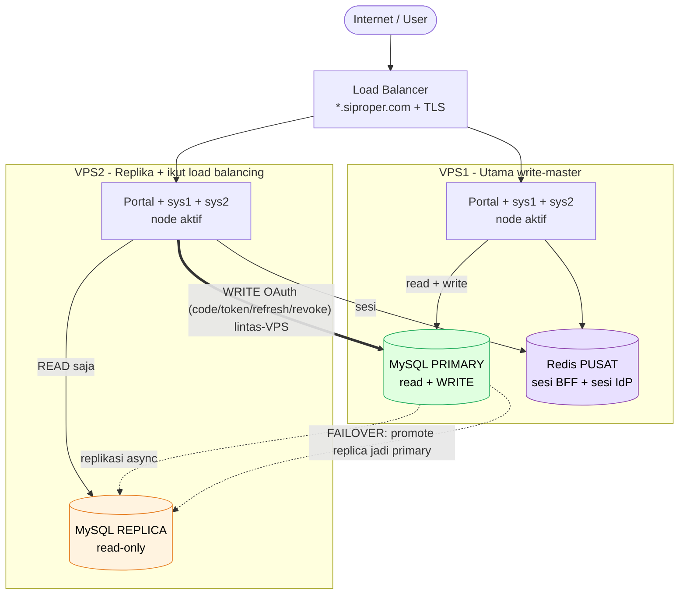
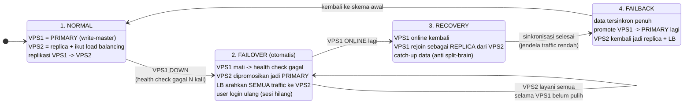

# Arsitektur SSO & Skema Mitigasi Server Down SiProper — by Sapphire Grup

> Status: **Rancangan (belum implementasi)**
> Tanggal: 2026-06-12
> Lingkup: Portal (Next.js), sys1 (Laravel 12), sys2 (Laravel 12 — Identity Provider)

---

## 1. Tujuan & Prinsip

**Tujuan fungsional**
1. User **login satu kali** di Portal, lalu bisa berpindah ke sys1 & sys2 tanpa login ulang (Single Sign-On).
2. **Otorisasi sesuai role & tenant**: user hanya melihat/mengakses menu yang menjadi haknya. Klik menu yang tidak berhak → tampilan "Anda tidak memiliki akses" (bukan error mentah).
3. Kredensial, role, permission, dan akses tenant (proyek + unit bisnis/area) **tetap dikelola di sys2** sebagai sumber kebenaran tunggal.

**Prinsip keamanan (non-negotiable)**
- **Single source of truth**: identitas & otorisasi hanya di sys2. Aplikasi lain tidak menyimpan password.
- **Kredensial hanya diinput di satu tempat**: halaman login terpusat milik sys2 (`auth.siproper.com`). Portal & sys1 **tidak punya form login sendiri** — mereka me-redirect ke IdP. Ini memperkecil attack surface.
- **Defense in depth**: menu yang disembunyikan di UI hanyalah kenyamanan. Setiap endpoint data **wajib** mengecek permission + scope tenant di server. Jangan pernah percaya klien.
- **Least privilege & short-lived tokens**: access token berumur pendek, refresh token dirotasi.
- **Standar terbuka**: pakai **OAuth2 Authorization Code + PKCE via Laravel Passport** — bukan skema buatan sendiri. (Bukan OpenID Connect: Passport tidak menyediakan `id_token`/`userinfo`/JWKS/discovery. Identitas diambil dari endpoint khusus `/api/me/authorization`.)

---

## 2. Peran Tiap Komponen

| Komponen | Peran SSO | Stack | Catatan kondisi sekarang |
|---|---|---|---|
| **sys2** | **Identity Provider (IdP) / Authorization Server** + Resource Server | Laravel 12 | Sudah pegang user (UUID), Spatie Permission + Filament Shield, multi-tenant `TenantContext` (proyek & area). Sudah ada JWT (tymon/jwt-auth) untuk API-nya. |
| **Portal** | **Relying Party (OAuth client)** + halaman home/menu launcher | Next.js 16 | Saat ini hanya landing page. Akan jadi pintu masuk + dashboard menu. |
| **sys1** | **Relying Party (OAuth client)** + Resource Server | Laravel 12 (dimiliki rekan) | Sudah ada konsep SSO lama via JWT query-string (akan diganti — lihat bagian 9). |

> **Catatan penting:** halaman login fisik sebaiknya **dipisah** ke host khusus IdP, mis. `auth.siproper.com` (boleh tetap satu aplikasi dengan sys2). Ini memisahkan peran "tempat ketik password" dari "aplikasi bisnis".

---

## 3. Pola Arsitektur Terpilih: OAuth2 Authorization Code + PKCE (Laravel Passport)

### Kenapa ini, bukan yang lain
- **Cookie-sharing lintas subdomain saja tidak cukup** — rapuh untuk Next.js (beda runtime), dan menyebar sesi mentah ke banyak app menaikkan risiko. Cookie `.siproper.com` tetap kita pakai, **tetapi hanya untuk sesi IdP** (agar SSO terasa "silent"), bukan sebagai mekanisme otorisasi antar-app.
- **JWT query-string (skema lama di `SSOController`) tidak aman**: token bocor di log/history/Referer, pakai HS256 shared-secret, dan login webhook pakai password statis di `.env`. Ini diganti total.
- **OAuth2 Code + PKCE** adalah standar industri: ada `state` (anti-CSRF), PKCE (anti code-interception), `code` sekali-pakai (anti-replay), redirect allowlist, refresh rotation, dan revocation. Library Laravel **Passport** menyediakannya out-of-the-box. **Bukan OIDC** — kita tidak pakai `id_token`/`nonce`/`userinfo`/JWKS; identitas & otorisasi diambil dari `/api/me/authorization` (bagian 6).

### Komponen di sys2 (Authorization Server)
Pasang **Laravel Passport** (OAuth2 server: PKCE, access token JWT RS256, refresh token, revocation). Endpoint:
- `GET  /oauth/authorize` — titik login/otorisasi.
- `POST /oauth/token` — tukar `code` → token, dan refresh (rotation).
- Revocation token (`/oauth/tokens/{id}` via API Passport / mekanisme revoke internal).
- `GET  /api/me/authorization` — **endpoint khusus kita**: kembalikan role, permission, `modules{}` (boolean resolved), daftar `proyek_id` & `area_id` yang boleh diakses (sumber identitas + otorisasi runtime). Lihat bagian 6.

**Tanda tangan token (penting — bukan JWKS):** Passport menandatangani access token JWT dengan **RS256** memakai keypair lokal hasil `passport:keys` → `storage/oauth-private.key` (hanya di IdP) & `storage/oauth-public.key`. **Tidak ada endpoint JWKS, discovery, atau rotasi otomatis.** Resource server (sys1/sys2) memverifikasi dengan **file `oauth-public.key` statis** yang di-deploy ke tiap server (lihat bagian 7, OV-1). Rotasi kunci = prosedur manual terjadwal (deploy keypair baru ke semua node), bukan fitur runtime.

> Passport berjalan **berdampingan** dengan `tymon/jwt-auth` yang sudah ada. JWT lama tetap melayani API internal/mobile sys2; Passport khusus untuk SSO lintas aplikasi. Migrasi bertahap, tanpa big-bang.

### Tipe client yang didaftarkan
| Client | Tipe | Alasan |
|---|---|---|
| Portal (Next.js) | **Confidential, via BFF** | Next.js punya server (Route Handlers). Token disimpan di server, browser hanya pegang cookie sesi httpOnly. Lihat bagian 5. |
| sys1 (Laravel) | **Confidential** | Backend Laravel menyimpan client secret dengan aman. |
| sys2-frontend | (opsional) | Jika UI sys2 perlu konsumsi token sendiri. |

Semua adalah **first-party clients** → consent screen di-skip (auto-approve), sehingga SSO terasa mulus.

---

## 4. Alur Login (Sequence)



**Inti "login sekali"**: di blok B tidak ada form login karena cookie sesi IdP sudah ada di `.siproper.com` (di-set pada blok A). Hanya login pertama (blok A) yang meminta kredensial.

> **Tidak ada "dashboard sys1".** Portal adalah satu-satunya launcher. Kartu "Sales" di Portal adalah **deep-link langsung ke modul Sales di sys1** (mis. `sys1.siproper.com/sales`). Langkah OAuth di blok B berlangsung **di balik layar (silent)** — dari sisi user: klik kartu → langsung mendarat di halaman modul Sales sesuai role & akses. Jabat-tangan OAuth hanya terjadi **sekali** saat pertama menyentuh sys1; klik modul sys1 berikutnya memakai sesi sys1 yang sudah ada.

> **Model akses sys1 (keputusan OV-7).** sys1 adalah **OAuth client penuh** dengan alur Authorization Code + PKCE-nya **sendiri** ke IdP, dan memegang access token ber-`aud=sys1`. **Portal TIDAK mem-proxy** panggilan ke sys1 — user diarahkan langsung ke sys1 (blok B), dan sys1 berjabat-tangan dengan IdP atas namanya sendiri. Konsekuensinya: tiap aplikasi punya token ber-`aud` sendiri (isolasi jelas, sys1 berdiri mandiri), dan Portal hanya memproxy ke **sys2** (mis. `/api/me/authorization`) untuk kebutuhan dashboard-nya.

> Diagram di atas memakai sintaks **Mermaid** — tampil sebagai diagram pada GitHub, VS Code (dengan preview Mermaid), Obsidian, dan editor markdown modern lain. Bila perlu versi gambar statis (PNG/SVG) untuk presentasi ke tim/pemilik sys1, beri tahu saya.

---

## 5. Pola BFF untuk Portal (Next.js) — keamanan token

**Backend-for-Frontend**: semua token (access/refresh) disimpan **di sisi server Portal**, tidak pernah dikirim ke browser.
- Browser hanya menerima **cookie sesi httpOnly + Secure + SameSite=Lax**, berisi ID sesi (opaque) → server Portal memetakan ke token tersimpan di **Redis** (TTL native + revocation instan).
- Panggilan dari Portal ke **sys2** (mis. `/api/me/authorization`) lewat Route Handler server-side yang melampirkan token `aud=portal` di header `Authorization`. **Portal tidak memproxy ke sys1** — sys1 diakses langsung oleh browser via deep-link dan punya alur OAuth sendiri (bagian 4 blok B, OV-7).
- **Efek keamanan**: walau ada XSS di Portal, token tidak bisa dicuri (tak ada di `localStorage`/JS). Ini mitigasi utama untuk SPA.

**Penanganan PKCE & `state` (server-side, bukan cookie):** `verifier` + `state` di-generate dan **disimpan server-side di Redis** (key acak ber-TTL pendek), bukan ditaruh di cookie. Browser hanya memegang **cookie pre-sesi `__Host-` (HttpOnly, Secure, SameSite=Lax)** berisi ID record tersebut. Saat callback, `state` divalidasi terhadap **record di Redis**, bukan terhadap nilai cookie — mencegah penyerang menanam state/verifier-nya sendiri.

Endpoint Portal (server-side):
- `/api/auth/login` → mulai Authorization Code flow (generate PKCE verifier+challenge & state; simpan di Redis; set cookie pre-sesi `__Host-`).
- `/api/auth/callback` → validasi `state` dari record Redis, tukar `code` + verifier → token, buat sesi Portal.
- `/api/auth/logout` → revoke token Portal + hapus sesi + redirect ke logout IdP (bagian 8).
- `/api/me` → kembalikan profil + kapabilitas menu (dari cache sesi).

> **Library client:** pakai klien OAuth2 + PKCE server-side (mis. **`arctic`** atau hand-rolled minimal) di Route Handler. **Bukan `openid-client`** — kita tidak butuh discovery/`id_token`/JWKS yang tidak disediakan Passport.

---

## 6. Model Otorisasi (gating menu "legal vs sales")

Otorisasi **tidak** dititipkan ke dalam access token (karena role/permission besar & bisa berubah; menanam di token = akses yang dicabut masih valid s/d token kedaluwarsa = celah). Sebagai gantinya:

### 6.1 Sumber kebenaran: endpoint authorization di sys2
`GET /api/me/authorization` (butuh access token), mengembalikan:
```json
{
  "user_id": "uuid",
  "roles": ["staff_legal"],
  "modules": { "legal": true, "teknik": false, "marketing": false, "keuangan": false },
  "permissions": ["view_lgl::land::bank", "view_any_lgl::land::bank", "..."],
  "tenants": {
    "proyek_ids": [12, 18],
    "area_ids": [3]
  },
  "fetched_at": "2026-06-23T08:00:00Z"
}
```
- **`modules{}` (boolean resolved)** = kapabilitas menu siap-pakai; **sys2 satu-satunya pemilik registry menu→permission** (keputusan C1) dan me-resolve-nya. Klien (Portal/sys1) cukup membaca boolean ini — **tidak** menghitung ulang dari `permissions[]`, agar definisi menu tidak terduplikasi di banyak tempat (DRY).
- **`permissions[]` (mentah)** disertakan untuk pengecekan granular per-aksi (mis. `can:view_any_lgl::land::bank`) di middleware server.
- **`fetched_at`** = stempel waktu otoritatif dari sys2; dipakai klien untuk perhitungan fresh/grace (OV-4), **bukan** sekadar TTL evict cache.

Diturunkan dari Spatie (`getAllPermissions`) + `TenantContext` (proyek/area yang ada sekarang). Tiap Relying Party meng-cache hasil ini di sesinya dengan **TTL pendek (mis. 60–120 dtk)** agar pencabutan akses cepat menyebar.

### 6.2 Registry menu → permission (kontrak bersama)
Definisikan peta kapabilitas (dimiliki & difinalkan sys2), dipakai konsisten di Portal, sys1, sys2. Prefix permission nyata sys2: `lgl` (legal), `tkn` (teknik), `mrk`/`mrkm` (marketing/sales):
```
menu "legal"     → butuh salah satu: view_any_lgl::land::bank, ... (family lgl)
menu "teknik"    → butuh salah satu: view_any_tkn::pra::proyek, ... (family tkn)
menu "marketing" → butuh salah satu: family mrk/mrkm
...
```
- **Portal**: **semua kartu modul selalu ditampilkan** (Sales, Legal, Teknik, Keuangan, dll) — tidak disembunyikan/dikunci. Saat user tanpa hak mengklik kartu, Portal **cek dulu dari cache permission (bagian 6.1) SEBELUM redirect** ke sys1/sys2 → jika tak berhak, **langsung tampilkan halaman `<NoAccess module="Legal" />`** ("Anda tidak memiliki akses ke modul ini") **tanpa melakukan redirect**. Keuntungan: lebih cepat (tanpa round-trip OAuth) dan tidak membocorkan URL/keberadaan modul. Tidak melempar error mentah.
  - sys1/sys2 **tetap punya gating sendiri** (lapis 2 & 3) sebagai lapis keamanan — pre-check Portal hanya kenyamanan UX, bukan satu-satunya penjaga (bypass deep-link tetap berhenti di sys1).
- **sys1 & sys2**: deep-link langsung ke modul tetap **dicek ulang di middleware server** (mis. `can:view_any_lgl::land::bank`). UI guard ≠ security guard.

### 6.3 Scope tenant (proyek & unit bisnis)
- sys2 sudah punya `BelongsToTenant` global scope + `TenantContext`. **Pertahankan & jadikan standar**.
- sys1 harus menerapkan filter setara: setiap query data difilter `WHERE proyek_id IN (accessible_ids)`. Tanpa ini, user bisa ganti `?proyek_id=` dan bocor lintas-tenant.
- `proyek_ids`/`area_ids` diambil dari endpoint bagian 6.1, bukan dari input klien.

**Tiga lapis penegakan** (semua wajib):
1. UI (Portal/sys1/sys2) — tampilkan halaman `NoAccess` bila tak berhak (kenyamanan, bukan keamanan).
2. Route/Controller middleware — `permission` + cek tenant (gerbang utama).
3. Query scope — `BelongsToTenant` (isolasi data, lapis terakhir).



> Lapis 1 hanya mengandalkan cache (TTL 60–120 dtk) → bisa "telat". Karena itu **lapis 2 & 3 adalah gerbang keamanan sebenarnya** dan selalu mengecek data otoritatif per request. Bypass UI (deep-link/ubah `?proyek_id=`) tetap berhenti di lapis 2/3.

### 6.4 Ketahanan saat sys2 tak terjangkau (grace & fail-closed — D4 + OV-4)

sys1 mengambil otorisasi via `/api/me/authorization` lalu meng-cache-nya. Saat **sys2 tidak terjangkau**, sys1 memutuskan berdasarkan `fetched_at` cache + **dua ambang**, bukan sekadar TTL evict:

| Kondisi cache | Operasi BACA (GET/list) | Operasi DESTRUKTIF/TULIS (create/update/delete/approve) |
|---|---|---|
| **Fresh** (umur ≤ TTL, mis. ≤120 dtk) | Izinkan | Izinkan |
| **Stale tapi dalam grace** (TTL < umur ≤ 10 mnt) & sys2 unreachable | Izinkan (pakai cache stale) | **Fail-closed segera** (tolak, 503/“coba lagi”) |
| **Hard-stale** (umur > 10 mnt) | **Fail-closed** | **Fail-closed** |

- **Keputusan OV-4:** aksi destruktif **tidak** ikut grace — begitu cache tak fresh, tulis/hapus langsung ditolak. Ini membatasi blast-radius akses yang baru dicabut pada operasi berbahaya, sambil tetap ramah untuk operasi baca selama gangguan singkat sys2.
- Saat sys2 **reachable**, cache yang lewat TTL di-refresh dulu sebelum dipakai (D4: fresh→allow; reachable→refresh; stale-in-grace→stale allow baca; else fail-closed).
- Ambang grace (10 mnt) dihitung dari **`fetched_at`** payload, bukan dari waktu insert cache lokal — agar konsisten lintas-node.

### 6.5 Kontrak integrasi sys1 ↔ sys2 (untuk dibekukan di Fase 1)

Penegasan pembagian kepemilikan data — sejalan dengan prinsip *single source of truth* (bagian 1). **sys2 adalah pemilik tunggal** definisi otorisasi; **sys1 hanya konsumen**, tidak mendefinisikan apa pun sendiri.

1. **Definisi permission, role, serta ID proyek & area dimiliki sys2.** sys1 tidak membuat daftar permission/role-nya sendiri.
2. **`proyek_id` & `area_id` memakai ID resmi dari sys2.** sys1 sudah mengonsumsi data proyek/area sys2 lewat API, jadi data yang disimpan sys1 sudah memakai ID yang sama dengan yang dikembalikan `/api/me/authorization`. **Tidak perlu tabel pemetaan ID** antar-sistem, dan tenant scoping sys1 (`WHERE proyek_id IN (...)`) langsung cocok.
3. **Nama permission diambil apa adanya dari sys2** (mis. `view_any_lgl::land::bank`). sys1 memakai string yang sama persis untuk pengecekan `can:...` — tidak menerjemahkan/menyalin ulang.
4. **Beban perubahan sys1 minimal** (perkiraan 3–5 hari): pasang paket SSO-client (OAuth client + validasi token RS256 via `oauth-public.key` statis + cache `/api/me/authorization` + grace/fail-closed), tambah adaptor kecil yang menyuntikkan `proyek_ids`/`area_ids` ke `TenantContext` yang sudah ada, lalu buang `SSOController` lama. **Tidak ada redefinisi otorisasi maupun migrasi data.**
5. **Grace authz sys1 diselaraskan dengan pola fallback yang sudah ada.** sys1 sudah punya ketergantungan runtime ke API sys2 (untuk proyek/area), jadi skenario "sys2 tak terjangkau" bukan hal baru — pakai pola cache/fallback yang sudah dipakai sys1, jangan paksa mekanisme baru.

> Karena sys1 & sys2 memakai fondasi yang sama (Spatie Permission + `BelongsToTenant`/`TenantContext`), integrasi ini berada di wilayah yang sudah dikuasai tim sys1 — risiko adopsi rendah.

---

## 7. Desain Token

| Token | Format | Umur | Isi | Catatan |
|---|---|---|---|---|
| Access Token | JWT RS256 (Passport) | **~15 mnt** | `sub`, `scope`, `aud`, `exp`, `jti` | **Tanpa role/permission detail** (ambil via bagian 6.1). `aud` = client penerima (`portal` / `sys1`). Identitas dasar (`sub`) dari sini; profil lengkap dari `/api/me/authorization`. |
| Refresh Token | opaque | ~8–24 jam | — | **Rotation** tiap pakai (bawaan Passport) + **reuse detection** → cabut seluruh family (**kerja custom**, lihat bagian 10). |

> Tidak ada **ID Token** (itu konstruksi OIDC). Identitas login diambil dari `/api/me/authorization`, bukan dari `id_token`/`userinfo`.

**Verifikasi di Resource Server (sys1/sys2) — keputusan OV-1:** cek tanda tangan **secara lokal** memakai file **`oauth-public.key` statis** (RS256), lalu validasi `iss`, `aud` (**harus client-nya sendiri**), dan `exp`. **Tolak token yang `aud`-nya bukan untuk dirinya.** Verifikasi ini **stateless — tanpa round-trip ke IdP** (tanpa introspection, tanpa JWKS), sehingga tahan terhadap beban/lag IdP & replication lag (bagian 13.4).

> **Trade-off OV-1:** karena validasi tidak menyentuh IdP, **pencabutan access token tidak instan** — token tetap valid s/d `exp`. Mitigasi: (a) access token pendek (~15 mnt); (b) pencabutan **akses/permission** efektif cepat lewat cache `/api/me/authorization` TTL pendek (bagian 6.1) + fail-closed destruktif (bagian 6.4); (c) pencabutan **refresh token** instan menghentikan perpanjangan sesi.

---

## 8. Single Logout (SLO)

1. User logout di Portal → Portal revoke refresh token-nya + hapus sesi Portal (Redis).
2. Redirect ke route logout di IdP → IdP hapus **cookie sesi IdP** (`.siproper.com`) + (opsional) revoke token milik user. Catatan: Passport tidak punya endpoint `end_session`/`logout_token` standar OIDC — route logout ini **kita buat sendiri** di sys2.
3. **Back-channel logout** (custom, ditunda — lihat TODOS bagian 8.3): IdP mem-broadcast sinyal logout ke client terdaftar. Bukan fitur bawaan Passport → perlu dibangun (daftar client + webhook + verifikasi). Tidak masuk Fase 1–3.
4. Tanpa back-channel: sesi sys1 tetap hidup s/d access token-nya expire (≤15 mnt) — risiko kecil & terbatas karena umur pendek.



---

## 9. Yang harus dihapus/diganti dari skema lama (penting untuk keamanan)

Skema `SSOController::indexSSO` saat ini memiliki celah dan **harus dipensiunkan**:
- ❌ Token JWT dikirim via **query string** (`?token=`) → bocor di log server, browser history, header Referer. → ganti: Authorization Code flow.
- ❌ **HS256 shared-secret** → siapa pun yang punya secret bisa memalsukan token. → ganti: **RS256 + public key statis** (`oauth-public.key`); private key (`oauth-private.key`) hanya di IdP.
- ❌ Login webhook pakai **username/password statis di `.env`** (`system` / `123456789`) → kredensial mesin statis & lemah. → ganti: client_credentials grant / mTLS antar server.
- ❌ Tidak ada `state`/PKCE. → disediakan oleh OAuth Code + PKCE (`state` anti-CSRF, `code` sekali-pakai anti-replay).

---

## 10. Hardening Checklist (anti-celah)

**Protokol**
- [x] Authorization Code + **PKCE (S256)** untuk semua client.
- [x] `state` (anti-CSRF) divalidasi ketat **dari record server-side (Redis)**, bukan dari cookie. `code` sekali-pakai (anti-replay).
- [x] **redirect_uri allowlist** persis (exact match, bukan prefix/wildcard).
- [x] **RS256 + public key statis** (`oauth-public.key`), bukan HS256, bukan JWKS. Private key hanya di IdP; **rotasi kunci = prosedur manual** (deploy keypair baru ke semua node), bukan runtime.
- [x] Access token pendek; refresh **rotation** (bawaan Passport).
- [ ] **Reuse-detection** (token refresh lama dipakai ulang → cabut seluruh family) — **KERJA CUSTOM**, bukan bawaan Passport. Belum tersedia; bangun di Fase 4.
- [x] Validasi `aud` (harus client sendiri) / `iss` / `exp` di setiap Resource Server.

**Transport & cookie**
- [x] HTTPS wajib + **HSTS**. `Secure`, `HttpOnly`, `SameSite=Lax` untuk semua cookie sesi.
- [x] Set `SESSION_DOMAIN=.siproper.com` **hanya** untuk cookie sesi IdP. Cookie sesi tiap app di-scope ke host-nya sendiri.
- [x] **BFF**: token tidak pernah sampai ke browser (anti-XSS token theft).

**Identitas & sesi**
- [x] Pertahankan **2FA/TOTP (Fortify)** & rate-limit/lockout login **di IdP**.
- [x] Idle & absolute session timeout di IdP.
- [x] Audit log: login, gagal login, issue/refresh/revoke token, akses ditolak.

**Otorisasi**
- [x] Otorisasi dicek **server-side di setiap app** (3 lapis bagian 6).
- [x] Tenant scope (`proyek_id`/`area_id`) **dari server**, tak pernah dari query klien.
- [x] Permission **tidak** ditanam di token (cegah akses-tercabut-masih-valid); pakai endpoint authorization + cache TTL pendek.

**Operasional**
- [x] Client secret di secret manager / `.env` yang tidak ter-commit; rotasi berkala.
- [x] CORS ketat (allowlist origin `*.siproper.com`).
- [x] Pisahkan host login IdP (`auth.siproper.com`) dari aplikasi bisnis.
- [ ] **Redis = SPOF auth** — memegang token BFF Portal + sesi pre-auth + cache authz. Kehilangan Redis = outage auth (login & sesi tumbang). Diterima untuk Fase 1–3 (failover = login ulang, bagian 13.2); naikkan ke Redis Sentinel/replica bila perlu tanpa-SPOF. Catat eksplisit di runbook.
- [ ] **Bekukan kontrak Fase 1**: skema `/api/me/authorization` + metode validasi token (RS256 public key statis) dibekukan di awal; sys1 (tim lain) diberi **mock IdP + conformance test** agar bisa integrasi paralel sebelum Fase 2 selesai.

---

## 11. Rencana Bertahap (phasing)

| Fase | Output | Tanpa mengganggu |
|---|---|---|
| **0 — Fondasi** | Tetapkan domain (`auth/portal/sys1/sys2 .siproper.com`), HTTPS, `SESSION_DOMAIN` IdP. | Aplikasi existing tetap jalan. |
| **1 — IdP** | Pasang Passport di sys2 (RS256, `passport:keys` → public key statis); buat endpoint `/api/me/authorization` (+`modules{}` resolved); daftarkan client Portal & sys1; definisikan registry menu→permission. **Bekukan kontrak** `/api/me/authorization` + metode validasi token + **kontrak integrasi sys1 ↔ sys2 (bagian 6.5)**; sediakan **mock IdP + conformance test** untuk sys1. | JWT lama sys2 tetap hidup. |
| **2 — Portal** | Bangun BFF login (PKCE, state+verifier di Redis), sesi httpOnly, dashboard menu dengan gating + halaman `NoAccess`. | sys1 belum disentuh (uji lewat mock IdP). |
| **3 — sys1** | sys1 jadi OAuth client (code-flow sendiri, `aud=sys1`) + Resource Server (validasi RS256 via `oauth-public.key` statis), grace/fail-closed (bagian 6.4), terapkan tenant scope setara `BelongsToTenant`, ganti `SSOController` lama. | Skema lama dimatikan setelah verifikasi. |
| **4 — SLO & cleanup** | Single Logout (route logout custom + back-channel custom), **reuse-detection (custom)**, audit log, hapus jalur SSO lama (query-string/HS256). | — |

---

## 12. Keputusan Final

1. **Host login** → **`auth.siproper.com` sebagai vhost** yang menunjuk ke aplikasi sys2 yang sama (bukan server/aplikasi terpisah). Cukup DNS + konfigurasi vhost; semua endpoint OAuth (authorize/token) + form login disajikan dari host ini. Memberi batas keamanan (CSP/rate-limit khusus) & fleksibilitas memindah IdP kelak tanpa mengubah `redirect_uri` client.
2. **Penyimpanan sesi Portal BFF** → **Redis**. Sesi dibaca tiap request → butuh latency rendah + TTL native + revocation instan. (sys2 sudah punya `REDIS_HOST` di `.env`.)
3. **Library OAuth2 client Next.js** → klien **OAuth2 + PKCE server-side** (mis. `arctic` atau hand-rolled minimal) di Route Handler BFF. **Bukan `openid-client`** (Passport bukan OIDC). PKCE `verifier` + `state` disimpan **server-side di Redis**, browser hanya pegang cookie pre-sesi `__Host-`.
4. **Launcher** → **Portal = satu-satunya launcher**. Semua kartu modul (Sales, Legal, Teknik, Keuangan, dll) **selalu ditampilkan**. Jika user tidak punya akses, saat kartu diklik Portal **cek dulu dari cache permission lalu langsung tampilkan `<NoAccess />`** ("Anda tidak memiliki akses ke modul ini") **tanpa redirect ke sys1/sys2** — kartu tidak disembunyikan/dikunci. Kartu yang berhak = **deep-link langsung ke modul** di sys1/sys2 (mis. `sys1.siproper.com/sales`), bukan ke "dashboard". sys1 & sys2 hanya menyajikan modul spesifik (tetap punya gating sendiri sebagai lapis keamanan) + tombol "◀ Kembali ke Portal".
5. **Cache permission** → **TTL 60–120 detik saja** (tanpa invalidasi event-based). Jendela basi maksimum ≤ TTL; risiko terbatas karena gerbang keamanan sebenarnya tetap cek server-side per request (bagian 6, 3 lapis) + scope tenant. Perubahan akses efektif paling lambat setelah TTL berakhir.
6. **Model akses sys1 (OV-7)** → sys1 = **OAuth client penuh dengan code-flow sendiri**, access token `aud=sys1`. **Portal tidak mem-proxy ke sys1** (deep-link langsung, bagian 4 blok B). Tiap aplikasi punya token ber-`aud` sendiri.
7. **Validasi token sys1 (OV-1)** → **public key statis lokal** (`oauth-public.key`, RS256), stateless, tanpa introspection. Trade-off pencabutan-tak-instan dimitigasi token pendek + cache authz pendek + revoke refresh (bagian 7).
8. **Grace saat sys2 down (OV-4)** → operasi **baca** boleh pakai cache stale dalam grace 10 mnt; operasi **destruktif/tulis fail-closed segera** begitu cache tak fresh (bagian 6.4).

---

## 13. Infrastruktur, Load Balancer & Skalabilitas

**Topologi target:** VPS1 (utama) menjalankan Portal + sys1 + sys2 + **MySQL primary** + **Redis pusat**. VPS2 menjalankan salinan sistem + **MySQL replica (read-only)**. Load balancer membagi traffic ke kedua VPS (aktif-aktif), dan VPS2 sekaligus berperan sebagai failover. **Keputusan: sesi boleh hilang saat failover** (user login ulang) — ini menyederhanakan infra.



### 13.1 Pembagian read/write database (WAJIB)
Replica MySQL bersifat **read-only**, sedangkan auth server **menulis di hampir setiap langkah** (authorization code, terbitkan token, refresh rotation, revoke, sesi). Maka:

| Operasi | Koneksi DB | Catatan |
|---|---|---|
| Tulis OAuth (code/token/refresh/revoke), tulis sesi | **MySQL PRIMARY (VPS1)** — selalu | Dari VPS2 = tulis lintas-VPS ke primary. |
| Baca authorization/profil/data modul | **Replica lokal** (VPS2) / primary (VPS1) | Aman dari replica + sudah di-cache (TTL 60–120 dtk). |
| Verifikasi tanda tangan token | **Tidak ke DB** | RS256 + public key statis (`oauth-public.key`) → stateless, tahan terhadap replication lag. |

Laravel: set koneksi `read` (replica) & `write` (primary VPS1) terpisah + `'sticky' => true` agar dalam satu request, setelah menulis, baca berikutnya ikut ke primary (hindari baca data basi karena lag). **Jangan pernah menulis ke replica.**

### 13.2 Sesi & load balancer (aktif-aktif)
Karena LB membagi traffic, request user yang sama bisa mendarat di VPS1 atau VPS2 → **sesi harus konsisten lintas-node**. Pilihan kita: **Redis pusat di VPS1** yang diakses kedua node (pola BFF kita memang sudah Redis). Sticky-session di LB tidak wajib.
- **Keypair RS256 (`oauth-private.key` + `oauth-public.key`) harus identik di kedua VPS** — keduanya aktif menerbitkan/memverifikasi token. Sinkron via deploy, bukan endpoint JWKS.
- **NTP sinkron wajib** di semua VPS — `exp`/PKCE sensitif terhadap selisih jam.
- Redis pusat di VPS1 = titik tunggal; karena **failover = login ulang** (keputusan diterima), ini dapat ditoleransi. Kalau nanti ingin tanpa SPOF, naikkan ke Redis Sentinel/replica.

### 13.3 Failover (VPS1 mati)
1. Promote **MySQL replica VPS2 → primary** (jadi read-write).
2. Arahkan write & DNS/LB ke VPS2.
3. Redis pusat (di VPS1) ikut hilang → **sesi hilang → user login ulang** (diterima). Login ulang berhasil karena DB sudah read-write di VPS2 dan signing key tersedia di VPS2.
4. Saat VPS1 pulih → re-sync sebagai replica, lalu (opsional) failback.

### 13.4 Kenapa RS256 (public key statis) penting untuk topologi ini
Validasi token tidak menyentuh DB maupun IdP sama sekali (cukup file `oauth-public.key` lokal — keputusan OV-1). Jadi resource server di VPS2 tetap memverifikasi token walau replica sedang lag, primary sedang sibuk, atau IdP sedang padat — **tidak ada single bottleneck untuk validasi**. Ini alasan teknis kita menolak HS256 shared-secret (bagian 9) **dan** introspection per-request (OV-1).

---

## 14. Mitigasi VPS1 Mati (Failover & Failback Otomatis)

Tujuan: layanan tetap hidup saat VPS1 (write-master) tumbang, lalu **otomatis kembali ke skema awal** begitu VPS1 pulih. Siklus 4 fase:



### 14.1 Deteksi & failover otomatis
- Health check (LB + watchdog) memeriksa VPS1 tiap beberapa detik. **Gagal N kali berturut** → VPS1 dinyatakan down.
- Aksi otomatis: (a) LB berhenti merutekan ke VPS1, semua traffic ke VPS2; (b) **MySQL replica VPS2 di-promote jadi primary** (read-write); (c) endpoint write aplikasi dialihkan ke VPS2 lewat **VIP mengambang (Keepalived)** atau **ProxySQL** — bukan ubah config manual.
- Sesi hilang (Redis pusat ikut mati bersama VPS1) → **user login ulang** (diterima, bagian 13.2).
- Tooling realistis untuk 2 VPS: **Keepalived (VIP) + skrip promosi**, atau **MySQL Orchestrator/MHA**, atau **ProxySQL** sebagai write-router.

### 14.2 VPS2 sebagai sumber tunggal (sementara)
- VPS2 melayani **SEMUA traffic** sebagai write-master mandiri sampai VPS1 pulih.
- Tulisan menumpuk di VPS2 → VPS2 menjadi sumber kebenaran sementara.
- Backup harian (bagian 14.4) tetap berjalan, kini dari VPS2.

### 14.3 Failback ke skema awal (anti split-brain)
- Saat VPS1 online, **VPS1 TIDAK langsung jadi primary** (cegah *split-brain* / dua primary menulis bersamaan). VPS1 **rejoin sebagai REPLICA dari VPS2** dan catch-up data dulu.
- Setelah tersinkron penuh, pada **jendela traffic rendah**: promote VPS1 → primary lagi, VPS2 → replica + LB, arah replikasi dibalik ke semula.
- LB kembali membagi traffic normal → **balik ke skema awal (bagian 13)**.
- Pengaman: **hanya satu primary pada satu waktu** (fencing / VIP tunggal). Jangan promote VPS1 sebelum benar-benar sinkron.

### 14.4 Cut-off replikasi 23:59 WIB (backup konsisten harian)
Tiap malam **23:59 WIB** (Asia/Jakarta, UTC+7) replikasi dijeda sejenak untuk mengambil backup point-in-time yang konsisten:
1. Di VPS2: `STOP REPLICA;` → replikasi dihentikan, data beku di titik konsisten.
2. Ambil backup dari replica (`mysqldump` / Percona XtraBackup / filesystem snapshot) — **tanpa membebani primary VPS1**.
3. `START REPLICA;` → replica mengejar ketertinggalan (lag sesaat, lalu sinkron lagi).

Manfaat: **backup + restore-point harian** yang konsisten, beban nol di primary. Dijadwalkan via scheduler ber-timezone WIB (cron `59 23 * * *` TZ=Asia/Jakarta). Saat fase FAILOVER, job tetap jalan dari VPS2 sebagai sumber data aktif.

---

## Lampiran — Aset Diagram (untuk presentasi)

Sumber Mermaid + hasil render (PNG hi-res & SVG) ada di [`docs/diagrams/`](docs/diagrams/README.md):

| Diagram | Bagian | File |
|---|---|---|
| Alur Login SSO | bagian 4 | `docs/diagrams/01-login-flow.{png,svg}` |
| Single Logout | bagian 8 | `docs/diagrams/02-single-logout.{png,svg}` |
| Gating Otorisasi 3 Lapis | bagian 6.3 | `docs/diagrams/03-gating-3-lapis.{png,svg}` |
| Topologi Infrastruktur (LB + replica) | bagian 13 | `docs/diagrams/04-infra-topology.{png,svg}` |
| Lifecycle Failover & Failback | bagian 14 | `docs/diagrams/05-failover-failback.{png,svg}` |

Render ulang setelah edit: lihat [docs/diagrams/README.md](docs/diagrams/README.md). Semua dirender lokal (Chrome sistem), tidak dikirim ke layanan online.

---

## GSTACK REVIEW REPORT — /plan-eng-review

> Review selesai 2026-06-23. Plan: `ARCHITECTURE_SSO.md`. Mode: eng manager (lock the execution plan).

### Keputusan terkunci (10)
| ID | Keputusan |
|---|---|
| D1 | Build inti SSO Fase 1–3 dulu; infra HA bagian 13–14 + back-channel SLO = track terpisah (TODOS). |
| D2 | sys1 & sys2 **DB terpisah** → sys1 ambil otorisasi runtime via `/api/me/authorization` (+cache). |
| D3 | **OAuth2 murni via Passport (BUKAN OIDC)**; validasi token via public key statis. |
| D4 | sys1 authz: fresh→allow; sys2 reachable→refresh; stale<grace(10m)→stale allow (baca); else fail-closed. |
| C1 | sys2 satu-satunya pemilik registry menu→permission; `/api/me/authorization` balikan `modules{}` boolean resolved. |
| D5 | Portal BFF auto-refresh on 401 + single-flight; refresh reuse → cabut family + login. |
| T1 | Tes sys2 (PHPUnit) + Portal (vitest/Playwright) penuh; sys1 di-mock via kontrak; E2E sys1 ditunda. |
| P1 | sys2 cache payload authz Redis `authz:{user_id}` TTL 60–90s; hindari TTL-stacking (staleness ≤120s). |
| **OV-7** | **sys1 punya token sendiri (code-flow sendiri, `aud=sys1`); Portal TIDAK proxy ke sys1.** |
| **OV-1** | **Validasi token sys1 = public key statis lokal (`oauth-public.key`), stateless, tanpa introspection.** |
| **OV-4** | **Aksi destruktif/tulis fail-closed segera saat cache tak fresh; baca boleh grace 10m.** |

### Temuan outside-voice yang diterapkan ke dokumen (OIDC → OAuth2/Passport)
- Buang JWKS/`id_token`/`nonce`/`userinfo`/discovery/`openid-client` — Passport tak punya. Public key = file statis `oauth-public.key`; klien Next.js = `arctic`/hand-rolled (bagian 3, 5, bagian 7, 12.3).
- PKCE `verifier` + `state` disimpan **server-side di Redis**, cookie pre-sesi `__Host-`; `state` divalidasi dari record server (bagian 5).
- Grace D4 pakai `fetched_at` + 2 ambang (fresh / hard-stale 10m), bukan TTL evict (bagian 6.4).
- Reuse-detection = **kerja custom**, di-uncheck di bagian 10 (bukan bawaan Passport).
- Redis = **SPOF auth** dicatat eksplisit (bagian 10 operasional).
- Kontrak `/api/me/authorization` + metode validasi token **dibekukan Fase 1**; sys1 dapat mock IdP + conformance test (bagian 10, 11).

### Review Readiness Dashboard
| Dimensi | Status | Catatan |
|---|---|---|
| Arsitektur | ✅ Lock | Pola, peran, token, flow konsisten OAuth2/Passport. |
| Code Quality | ✅ Lock | C1 (DRY registry menu→permission, satu pemilik = sys2). |
| Tests | ✅ Lock | T1; test plan di `~/.gstack/.../eng-review-test-plan-*.md`. |
| Performance | ✅ Lock | P1 cache authz Redis + anti TTL-stacking. |
| Keamanan | ✅ Lock | 3 lapis gating; fail-closed destruktif; token pendek; BFF anti-XSS. |
| Infra HA / Failover | ⏸️ Deferred | bagian 13–14 → track terpisah (TODOS.md), tak menghambat Fase 1–3. |

### Kerja custom yang HARUS dibangun (bukan bawaan Passport)
1. Endpoint `/api/me/authorization` (+ `modules{}` resolver) & cache Redis.
2. Refresh **reuse-detection** + revoke family (Fase 4).
3. Route logout IdP + **back-channel logout** (Fase 4, ditunda).
4. Grace/fail-closed authz di sys1 (bagian 6.4).
5. Mock IdP + conformance test untuk integrasi paralel sys1.

### Siap implementasi
Plan terkunci. Mulai **Fase 1 (IdP)** setelah kontrak `/api/me/authorization` + metode validasi token dibekukan & mock IdP tersedia.
